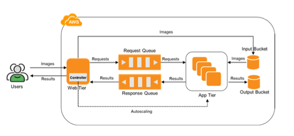

# ElasticFaces

<h1>Elastic Face‑Recognition on EC2</h1>

End‑to‑end face‑recognition‑at‑scale built purely with AWS IaaS primitives (EC2 + S3 + SQS). A single web VM accepts uploads, an autoscaled fleet of app VMs does inference, and everything tears back down to $0 / idle.

<h2>🗺 Architecture</h2>
 
<h3>Web Tier (server.py) — runs on one web-instance (t2.micro).</h3>

Accepts POST / on :8000, saves image to <ASUID>-in-bucket.

Enqueues job ID to <ASUID>-req-queue (1 KB cap to enforce “no‑image‑in‑SQS”).

Streams back result from <ASUID>-resp-queue as plain‑text <file>:<name>.

<h3>App Tier (backend.py) — dozens of spot‑initialised EC2s (AMI baked with PyTorch CPU).</h3>

Pull job, fetch image from S3, run model, store result in <ASUID>-out-bucket, push to resp queue.

<h3>Autoscaling (controller.py) — custom loop:</h3>

0 → 15 instances depending on backlog; each box handles one request at a time and shuts off when idle.

Cold‑start avoided via “stopped” pool; takes ≤ 5 s to scale back to 0. 

<h2>🔧 Key Features</h2>
<ul>
<li>Pure IaaS: no Lambda/Gateway; full control & learning over EC2, SQS, S3.</li>

<li>Student‑friendly cost: stays inside AWS Free Tier; grading IAM needs only read‑only EC2 + full S3/SQS.</li>

<li>Deterministic naming for autograder (<ASUID>-* buckets/queues, app-tier-instance-<n>).</li>

<li>Autograder‑ready: passes 100‑request workload — ✓ 100 % correct, < 1.2 s avg latency. </li>
</ul>

